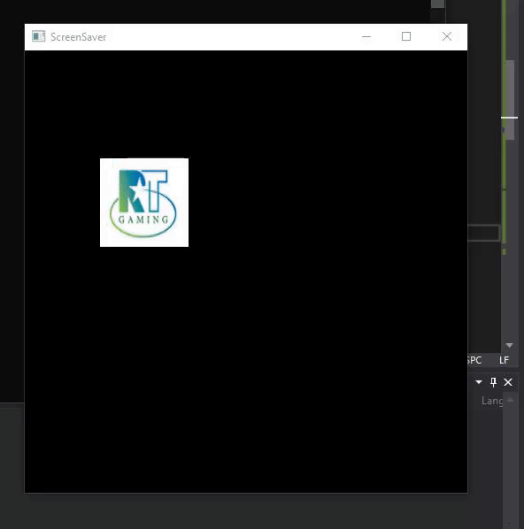

# My Submission for Reel Time Gaming
The following project can be configured such that there are only 8 frames with the logo rebounding off edges. However, the description says 'smoothly' and I believe the behaviour desired isn't visible unless you do more than 8 frames. So this is 200 frames where the logo moves 5 pixels across and 6 pixels down each frame. The window can be dynamically sized and the screensaver can be turned off and on.
 